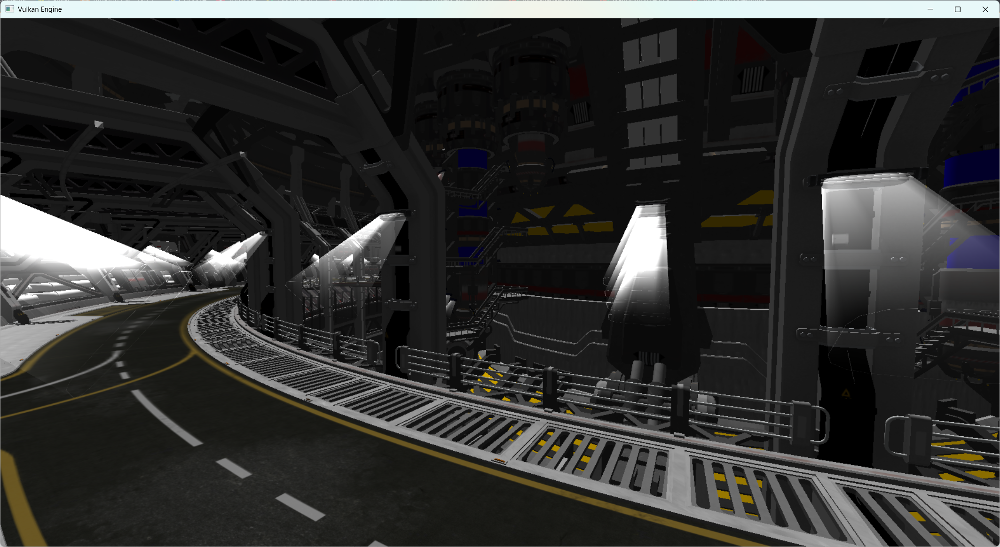

<!-- ABOUT THE PROJECT -->
## About The Project



This project is my attempt at building a Vulkan renderer from scratch in C++. It is my first project using Vulkan, and I built it to learn modern, low-level graphics programming. Much of the engine architecture and the learning path follows the [Vulkan Guide](https://vkguide.dev/) tutorial, and this repository covers everything up to and including chapter 5.

Through this project I learned how to:

* Set up a Vulkan application: instance, physical/logical device, queues, swapchain, and per-frame synchronization
* Record and submit command buffers, and render with dynamic rendering
* Write GLSL shaders and compile them to SPIR-V
* Build graphics and compute pipelines, including a compute-shader background effect
* Manage GPU memory and buffers with the Vulkan Memory Allocator
* Use descriptor sets and descriptor allocators to bind resources to shaders
* Load and render 3D meshes and glTF scenes, with textures and materials
* Structure a renderer around a draw context, mesh nodes, and a scene graph
* Optimizing draw calls by sorting objects and implementing frustum culling
* Use depth testing and reverse-Z depth buffering
* Integrate Dear ImGui for runtime debug and tuning UI

<!-- Getting Started -->
## Getting Started

### Prerequisites

* You will need [Visual Studio](https://visualstudio.microsoft.com/) with the "Desktop development with C++" workload, to build and run the program
* Make sure to install [Vulkan SDK](https://vulkan.lunarg.com/sdk/home), which provides the Vulkan headers, validation layers, and the shader compiler

### Installation

1. Clone the repo
```sh
   git clone https://github.com/github_username/repo_name.git
```
2. Build the `shaders` target to compile the GLSL shaders to SPIR-V
3. Set the `engine` target as the startup project and run it by pressing F5